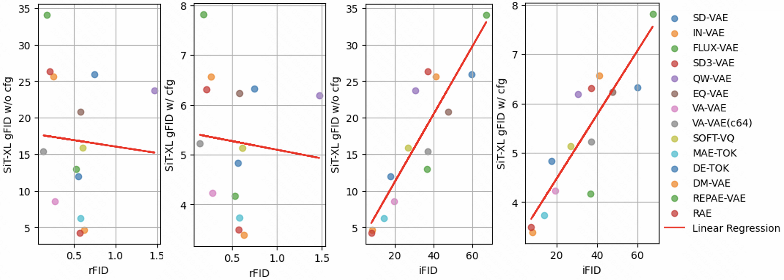

# Making Reconstruction FID Predictive of Diffusion Generation FID
* Arxiv: TODO
* Huggingface: TODO
## Brief
* Reconstruction FID of VAE are often negatively correlated with generation FID of latent diffusion.
* We slightly change the rFID computation into interpolated FID (iFID) to make it highly correlated to gFID.
* 

## Installation
* install requirements
    ```bash
    TODO
    ```
* install by pip
    ```bash
    git clone ...
    cd ...
    pip install -e .
    ```
## USAGE: iFID Evaluation
* To evaluate iFID for a VAE
  * You need to download the ImageNet dataset first
  * Then run the script:
    ```bash 
    accelerate launch --num_processes=4 --gpu_ids="0,1,2,3" ifid.py \
        --seed=0 \
        --sample-dir="./samples" \
        --exp-name="ifid-sdvae" \
        --dataset="./ImageNet/val" \
        --dataset-ref="./ImageNet/train"
        --vae-config="./configs/SDVAE.yaml"
    ```
## USAGE: VAE Arena for Diffusion Generation
* We train SiT-B, and SiT-XL model on ImageNet for 40 epoch, and evaluate the gFID.
* To train SiT-B for SDVAE:
  * You need to download and prepare imagenet dataset first. 
    ```bash
    python preprocessing.py --imagenet-path "./ImageNet/train" --output-path "./ImageNeth5"
    ```
  * Then run the training
    ```bash
    accelerate launch --num_processes=4 --gpu_ids="0,1,2,3" train.py \
        --max-train-steps=400000 \
        --report-to=wandb \
        --allow-tf32 \
        --mixed-precision=no \
        --data-dir="./ImageNeth5" \
        --output-dir="./exps" \
        --batch-size=128 \
        --model="SiT-B/2" \
        --vae-config="./configs/SDVAE.yaml" \
        --bn-momentum=0.1 \
        --exp-name=sit-b-sdvae-400k
    ```
* To sample the trained SiT-B for SDVAE
  * you need to download fid reference batch first https://openaipublic.blob.core.windows.net/diffusion/jul-2021/ref_batches/imagenet/256/VIRTUAL_imagenet256_labeled.npz:
  * Then run the sampling
    ```bash
    torchrun --nnodes=1 --nproc_per_node=4 --master_port 0 generate.py \
        --num-fid-samples 50000 \
        --mode sde \
        --num-steps 250 \
        --cfg-scale 1.0 \
        --guidance-high 1.0 \
        --guidance-low 0.0 \
        --exp-path "./exps/sit-b-sdvae-400k" \
        --fid-reference-file "VIRTUAL_imagenet256_labeled.npz" \
        --train-steps 400000
    ```
* The result is strongly correlated with our iFID

    |              | gFID SiT-XL w/o cfg | gFID SiT-B w/o cfg | iFID | VAE config | SiT config |
    |--------------|----------------|---------------|------| ---------------|------| 
    | SD-VAE       | 25.91 |               | 59.91 | SDVAE.yaml | SiT-XL/2, SiT-B/2 |
    | FLUX-VAE     | 34.06 | 63.32 | 67.41 | FLUX.yaml | SiT-XL/2, SiT-B/2 |
    | QW-VAE       | 23.62 | 48.34 | 30.58 | QWVAE.yaml | SiT-XL/2, SiT-B/2 |
    | SD3-VAE      | 26.38 | 51.39 | 37.13 | SD3VAE.yaml | SiT-XL/2, SiT-B/2 |
    | EQ-VAE       | 20.81 | 37.81 | 47.51 | EQVAE.yaml | SiT-XL/2, SiT-B/2 |
    | IN-VAE       | 25.65 | 49.17 | 41.06 | INVAE.yaml | SiT-XL/1, SiT-B/1 |
    | VA-VAE       | 8.57 | 17.63 | 19.57 | VAVAE.yaml | SiT-XL/1, SiT-B/1 |
    | VA-VAE (c64) | 15.4 |               | 37.14 | VAVAE64.yaml | SiT-XL/1, SiT-B/1 |
    | SOFT-VQ      | 15.88 |               | 26.91 | SOFTVQ.yaml | SiT-XL/1D, SiT-B/1D |
    | MAE-TOK      | 6.27 |               | 14.06 | MAETOK.yaml | SiT-XL/1D, SiT-B/1D |
    | DE-TOK       | 11.97 |               | 17.51 | DETOK.yaml | SiT-XL/1D, SiT-B/1D |
    | DM-VAE       | 4.65 | 8.69 | 8.14 | DMVAE.yaml | SiT-XL/1D, SiT-B/1D |
    | REPAE-VAE    | 12.95 |               | 36.70 | REPAEVAE.yaml | SiT-XL/2, SiT-B/2 |
    | RAE          | 4.25 |               | 7.68 | RAE.yaml | SiT-XL/1, SiT-B/1 |


## To Include Your VAE in VAE Arena
* implement your vae in a separate py fite in ./ifid/vae/, add config file in ./configs/
* submit a pull request


accelerate launch --num_processes=4 --gpu_ids="0,1,2,3" ifid.py \
    --seed=0 \
    --sample-dir="./samples" \
    --exp-name="ifid-sdvae" \
    --dataset="/video_ssd/lpm/ImageNet/train" \
    --dataset-ref="/video_ssd/lpm/ImageNet/val" \
    --vae-config="./configs/SDVAE.yaml" \
    --small 500
